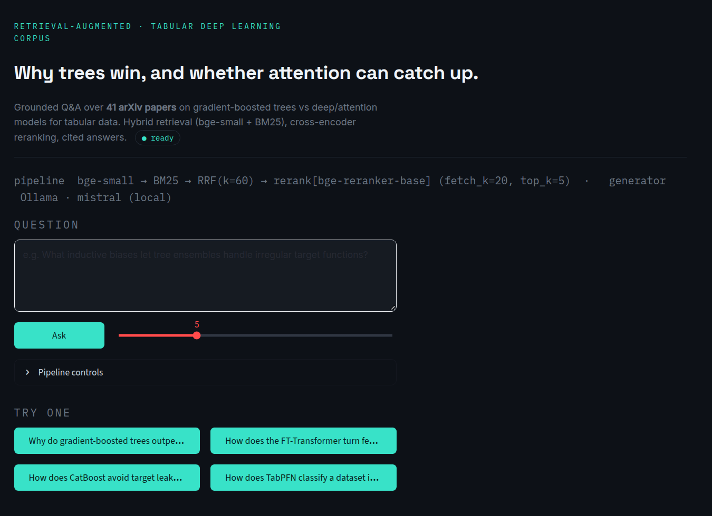

# Tabular-DL Research Assistant · RAG

Grounded question-answering over the research literature on **why gradient-boosted
trees do so well on tabular data, and whether attention / transformer
architectures can beat them.**

Ask a question → the system retrieves passages from a frozen corpus of **41 arXiv
papers**, reranks them with a cross-encoder, and has an LLM write a **cited**
answer using only those passages. Every source is shown with its retrieval score
and which retriever surfaced it.

**Live demo:** _(Streamlit Community Cloud link goes here)_
· **[Evaluation results](eval/results.md)**



```
question ─▶ embed (bge-small, query prefix) ─▶ dense search (Chroma)  ─┐
           tokenize ─────────────────────────▶ BM25 (rank-bm25)       ├─▶ RRF fuse
                                                                      ▼
                                       cross-encoder rerank (bge-reranker-base)
                                                                      ▼
                              top-k passages ─▶ grounded prompt ─▶ LLM ─▶ cited answer
                                                                      ▲
                                            Ollama (local)  ·  Gemini (hosted demo)
```

---

## Why this is built the way it is

| Decision | Reasoning |
|---|---|
| **Frozen, hand-checked corpus** (not keyword-expanded) | An earlier version grew the corpus with arXiv keyword search. It pulled in ~16 off-topic papers (CFD, medical imaging, *"The Modern Mathematics of Deep Learning"*) which, being long, were **>50% of the chunks** — retrieval was mostly searching noise. The corpus is now 41 papers chosen by hand; `src/seed_papers.py` is the single source of truth. |
| **Hybrid retrieval (dense + BM25, fused with RRF)** | Dense retrieval blurs exact tokens — method acronyms (`NODE`, `SAINT`), symbols, equation names. BM25 nails those. They fail on different queries, so fusing their *rankings* is safer than either alone. RRF fuses ranks, not scores, so no score calibration between two very differently-scaled retrievers is needed. |
| **Cross-encoder reranking** ("retrieve wide, rerank narrow") | A bi-encoder (bge-small) embeds query and passage separately; a cross-encoder reads them together and is much more accurate but much slower. So the cheap retriever pulls 20 candidates and the expensive cross-encoder scores only the top 12. This is the **single biggest quality lever** (numbers below). |
| **Low-confidence guard** | bge-small cosine similarity sits around 0.45–0.55 even for unrelated text and ~0.80+ for on-topic — a threshold near 0.60 cleanly separates them. If the best passage is below it, the UI warns instead of confidently answering from noise. Calibrated against the eval set + out-of-domain probes. |
| **Pluggable generator** | One `Generator` interface, two backends: **Ollama** (local, offline, the honest "runs on a laptop" story) and **Gemini** (hosted demo, where a local model isn't available). Nothing else in the codebase imports an LLM SDK. |
| **Store shipped as an LFS tarball** | Chroma writes bookkeeping to its SQLite file on *every query*, so a committed live directory shows as "modified" after any read. `data/chroma.tar.gz` is the immutable artifact; `store.ensure_store()` extracts it on first use — a fresh clone / CI / the deployed app get a working store in ~1 s, no rebuild. |

---

## Results

Full report and methodology: **[`eval/results.md`](eval/results.md)** ·
regenerate with `make eval-ablation`.

39 labeled questions, paper-level ground truth (`src/eval_questions.py`), CPU.

| pipeline | hit@1 | hit@3 | hit@5 | hit@10 | MRR | p50 latency |
|---|---|---|---|---|---|---|
| dense | 0.821 | 0.897 | 0.949 | 0.974 | 0.875 | 20 ms |
| hybrid (BM25 + RRF) | 0.846 | 0.949 | 0.949 | 0.974 | 0.897 | 37 ms |
| dense + rerank | 0.821 | 0.974 | **1.000** | **1.000** | **0.900** | 1.8 s |
| **hybrid + rerank** (default) | 0.795 | 0.949 | 0.974 | 1.000 | 0.878 | 2.0 s |

- **Reranking is decisive** — it takes hit@5 to 1.000 (every question's gold paper in the top 5).
- **BM25 helps on its own** — hybrid beats dense at MRR (0.897 vs 0.875) and hit@1.
- **Under reranking, hybrid vs dense is within noise** on 39 questions (~1 question per point). Hybrid is kept on by default as a safety net for exact-term queries the eval under-samples; `dense + rerank` is a legitimate, slightly cheaper choice.
- **Guard rail:** 4/4 out-of-domain probes correctly flagged low-confidence, in every configuration.
- Answer faithfulness (LLM-as-judge) is reported **separately** — see `eval/results.md`.

---

## Run it locally

```bash
python -m venv .venv && source .venv/bin/activate
pip install -r requirements-dev.txt && pip install -e .

make store        # extract the shipped vector store (data/chroma.tar.gz)
make app          # Streamlit UI at http://localhost:8501
```

The default generator is **Ollama** (offline). Install it and pull a model:

```bash
ollama pull mistral      # ~4 GB, runs on CPU / 16 GB RAM
```

To use Gemini instead (fast, no local model), copy `.env.example` to `.env` and set:

```
GENERATOR=gemini
GEMINI_API_KEY=...        # free key: https://aistudio.google.com/apikey
```

Everything is configured through `src/config.py` (env / `.env` overridable):
retrieval mode, rerank on/off, `fetch_k` / `top_k`, RRF constant, chunking.

### Common tasks

```bash
make eval             # retrieval metrics for the configured pipeline
make eval-ablation    # the dense / hybrid / +rerank table -> eval/results.md
make eval-judge       # + LLM-as-judge answer faithfulness (needs a generator)
make ingest           # rebuild the store from src/seed_papers.py, then repack the tarball
make test             # pytest
make lint             # ruff
```

---

## Layout

```
src/
  config.py        pydantic-settings: every tunable, env-overridable
  seed_papers.py   the frozen 41-paper corpus (+ known non-arXiv gaps)
  ingest.py        fetch → parse (strip refs) → chunk → embed → Chroma
  store.py         tarball ⇄ live-directory packaging
  retrieval.py     Retriever: dense · BM25 · RRF · cross-encoder rerank → RetrievalResult
  generation.py    Generator protocol · OllamaGenerator · GeminiGenerator
  rag.py           thin facade: build_prompt · generate · answer · health_check
  evaluate.py      hit-rate@k / MRR / ablation / guard rail / LLM-judge
  eval_questions.py 39 labeled questions + out-of-domain probes
  app.py           Streamlit UI
eval/results.md    committed evaluation report
tests/             36 tests · ruff clean · CI on every push
```

## Corpus

41 arXiv papers grouped by thread in `src/seed_papers.py`: the trees-vs-DL debate
(Grinsztajn, Shwartz-Ziv, McElfresh…), GBDT foundations (XGBoost, CatBoost),
attention architectures (TabNet, SAINT, FT-Transformer, ExcelFormer, Trompt…),
boosting-inspired / tree-mimic nets (NODE, GrowNet, GRANDE, Net-DNF…), feature
embeddings, foundation models & LLMs (TabPFN, TabLLM, XTab, CARTE), retrieval-based
(TabR, ModernNCA), transfer / SSL, generative (TabDDPM), and two surveys.

Three foundational papers (LightGBM, DeepGBM, Friedman's original GBM) are **not
on arXiv**; `ingest.py` reports them as known gaps rather than silently omitting
them.
